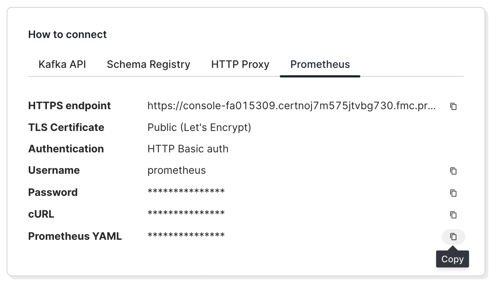

# Redpanda Cloud

Redpanda Cloud exposes an OpenMetrics endpoint that can be scraped using Prometheus or other
compatible tools. This example shows how to set up Prometheus and Grafana to work with
clusters in Redpanda Cloud.

---

**NOTE**: This is for instructional purposes only and not meant for production use. For production,
we recommend deploying Prometheus and Grafana standalone or as a managed service. You can then
directly import the dashboards provided in the [grafana-dashboards](../grafana-dashboards)
directory into Grafana.

---

## Setup

To get started, clone this repository into a local directory named `observability`.

## Browse the project

Navigate to the cloud example:

```
cd observability/cloud
```

In there you will see a config directory with the following structure:

```
config
├── grafana
│   └── provisioning
│       ├── dashboards
│       │   └── redpanda.yaml
│       └── datasources
│           └── prometheus.yaml
└── prometheus.yml
```

This directory is mounted by Docker to provide configuration and other needed files by the
Prometheus and Grafana containers. You will need to modify `config/prometheus.yml` such that
it points to the information provided by Redpanda Cloud.

## Go to Redpanda Cloud

The Redpanda Cloud Overview page contains details on how to configure Prometheus to scrape
metrics from the cluster. To view this information, go to ** Overview > How to connect > Prometheus **.
You should see something like the following:



Click on the icon to the right to copy the contents of **Prometheus YAML** into your clipboard.

## Edit `config/prometheus.yml`

Open up `config/prometheus.yml` and replace everything under the `-- REPLACE BELOW --` line with
the clipboard contents that you just copied. Alternatively, you can simply replace the target
hostname and password -- both pieces of information are also provided in the Redpanda Cloud UI.

You should end up with a configuration that looks something like this:

```
global:
  scrape_interval: 10s
  evaluation_interval: 10s

scrape_configs:
  # The job name is added as a label `job=<job_name>` to any timeseries scraped from this config.
  # Replace the section below with what you've copied from `Prometheus YAML`
  # in the "Redpanda Cloud > Overview > How to connect" Screen
  # ---------------- REPLACE BELOW ----------------------
- job_name: redpandaCloud-clustername
  static_configs:
    - targets:
        - somehostname.cloud.redpanda.com
  metrics_path: /api/cloud/prometheus/public_metrics
  basic_auth:
    username: prometheus
    password: REDACTED
  scheme: https
```

## Run Docker Compose

Bring up Prometheus and Grafana using Docker Compose:

```
docker compose up -d
```

Point your browser to [localhost:3000](http://localhost:3000) to view the dashboards in Grafana.


